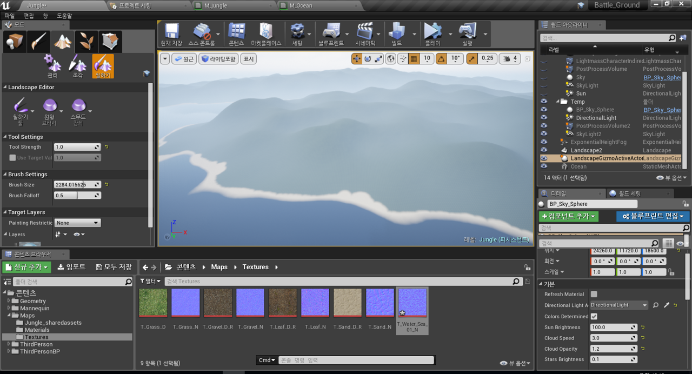
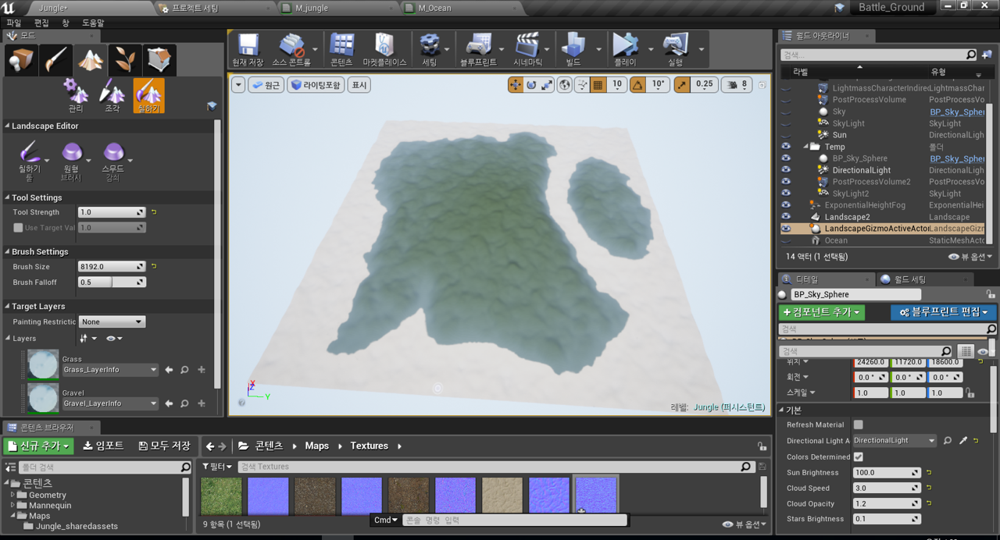

# BattleGround

Date : 18.05.05~ 
Unreal Engine

### 05/06

static 메시를 foliage로 만들려면 foliage type을 만들어야 된다. 

컬링 거리는 인스턴스가 사라지는 거리이다. 

나무의 경우 칠하기가 가능한 landscape를 grass만 지정해놓아 해변에는 칠해지지 않는다.  

잔디는 그림자를 끄는 것이 좋음.
 

작은 foliage를 관리하기 위해서는 스트리밍 레벨을 사용한다. 

레벨은 퍼시스턴트 레벨과 스트리밍 레벨이 있으며 
피스스턴트 레벨은 나무와 비슷한 것들, 멀리서도 보여야 되는 것들을 두는 거고 
스트리밍 레벨은 잔디와 비슷한 것들, 멀리서 안 보여도 문제가 되지 않는 것들
그렇기에 메모리 관리를 하기 위한 에셋들을 두는 공간이다. 

현재 레벨을 잘 확인 할 것. 
엑터를 어디에 추가하는지 확인! 

폴리지는 자신이 칠해지는 랜드스케이프의 레벨에 적용이 됨.!!
고로 폴리지의 옵션에서 현재 레벨에 배치라는 옵션을 활성화 시켜야 레벨 단위 저장이 됨. 

거리에 따라 폴리지가 사라지고 나타나는 것은 [레벨 바운드]라고 한다. 

큐브 엑터를 하나 두고 alt누르고 복사해서 놓으면 레벨 바운드가 자동적으로 생김. 
이제, 이 박스와 내 카메라의 거리가 500m 정도 되면 이제 로딩을 시키는 개념. 

레벨 바운드는 수동으로 지정할 수 있음. 